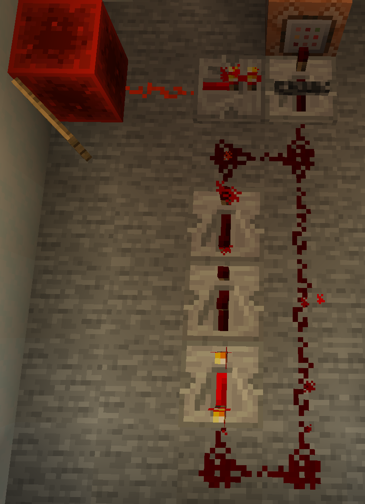

# Race & Lap counter

Race logic, counting laps and win conditions

## Lap counter




### Image explanation

The first image is the timing system in its entirety.
The second image is specifically the redstone "clock" that converts ticks into seconds by adding specific delay.
Notice the repeater timing, as well as the blocking repeater. The blocking repeater terminates the system, by disengaging the command block from the redstone.

### Setup

Replace `<name>` with the name of the scoreboard you want to display.
Replace `<display_name>` with the display name of the scoreboard you want to display.

```shell
/scoreboard objectives add <name> dummy <display_name>
```

### Command blocks

#### Timer Command Block

You will need to create 3 command blocks at mininum, 2 more optionally (disable & enable command logging).
The first in the sequence should be Impulse, Unconditional, and Needs Redstone.
The others should be Chain, Unconditional, and Always Active.

The target selector in our case relies on a `Tag` for the system to work.
e.g `@a[tag=Timer]`

```shell
/scoreboard players add <target_name> <name> 1
```

#### Reset Command Blocks

Reset & delete to ensure it doesn't linger

```shell
/scoreboard players reset <target_name> <name>
/scoreboard players remove <target_name> <name>
```

## Race


### Setup

Replace `<name>` with the name of the scoreboard you want to display.
Replace `<display_name>` with the display name of the scoreboard you want to display.

```shell
/scoreboard objectives add <name> dummy <display_name>
```

Replace `<target_name>` with the name of the player/selector.

```shell
/tag <target_name> add <name>
```

### Race Start
