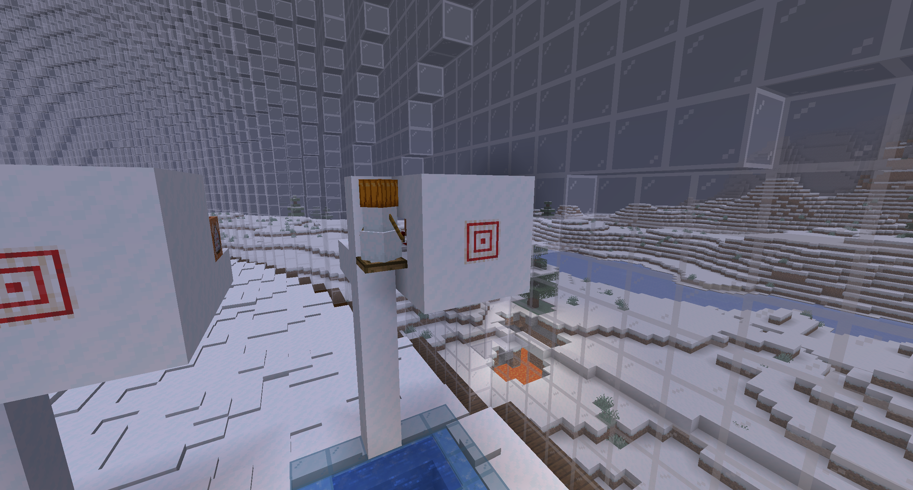
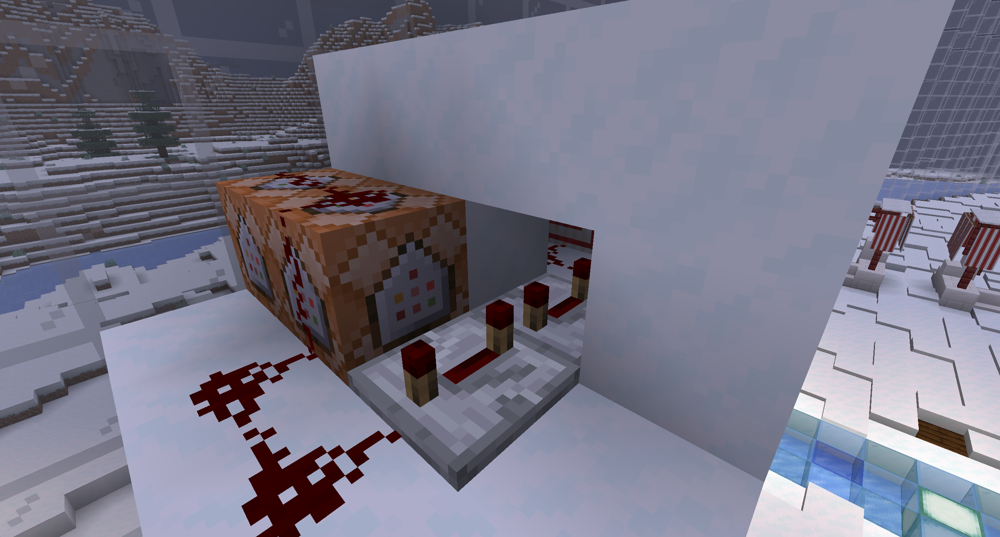

# Target Practice Counter

Counts the number of times a target has been hit.




## Setup

Replace `<name>` with the name of the scoreboard you want to display.
Replace `<display_name>` with the display name of the scoreboard you want to display.

```shell
/scoreboard objectives add <name> dummy <display_name>
```

## Command blocks

You will need to create two command blocks.
They should be Impulse, Unconditional, and Needs Redstone.

### First command block

```shell
/scoreboard players add <target_name> <name> 1
```

### Second command block

Replace coordiantes with where you want the snow golem to spawn.
Remeber snow golems must spawn .6 further away from the side
 where your trap door attaches.

```shell
/summon minecraft:snow_golem -3479 80 1609.6 {CustomName:'[{"text":"Something funny"}]'}
```
